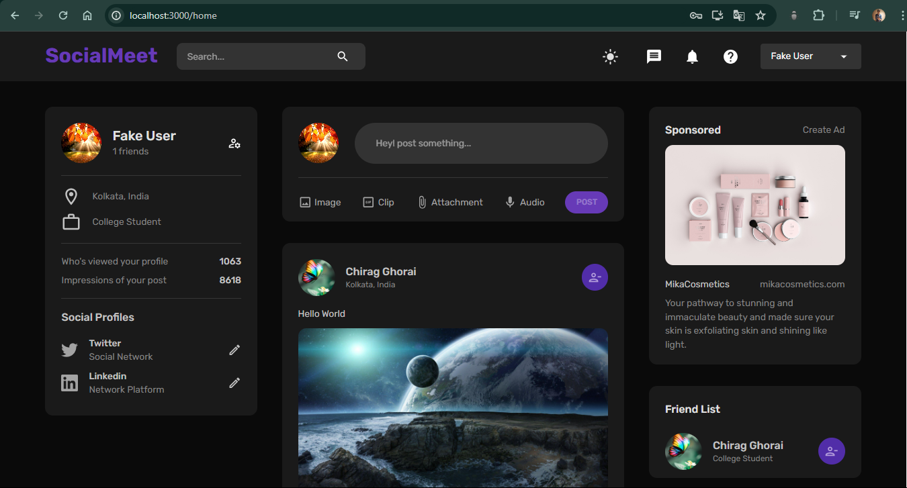
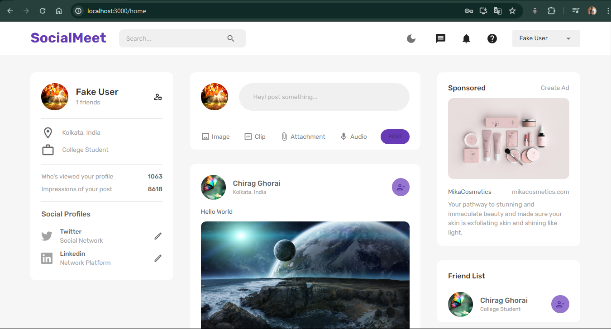
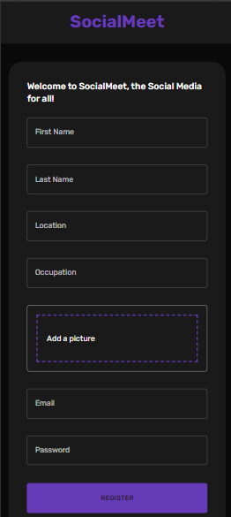
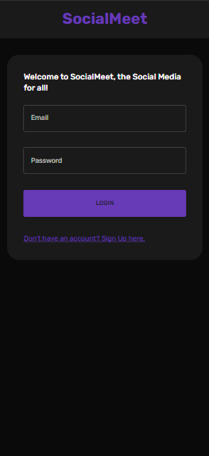
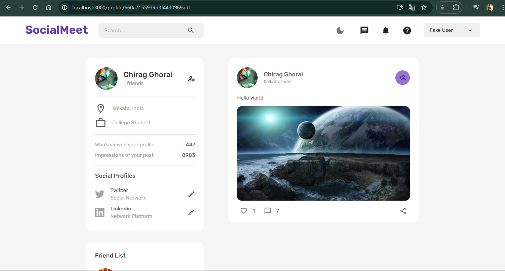

# 🌑 **SocialMeet**

SocialMeet is a social media platform where users can connect with friends, share updates, and interact with each other through posts, comments, and likes.

<!-- ### The site is currently running at [https://perfect-pear-yoke.cyclic.app/](https://perfect-pear-yoke.cyclic.app/) -->

## 📸 Some Clips

#### Home Page <br/>

  <br/>

#### Register & Login <br/>

     <br/>

#### Profile <br/>

<br/>

## ✨ Features

- **👤 User Authentication:**  Users can register and log in. Passwords are hashed for security. JWT tokens are issued upon successful login for subsequent authenticated requests.
- **📝 Create Posts:**  Users can create posts to share updates, thoughts, and media content.
- **❤️ Like Posts:**  Users can like posts to show appreciation for content shared by others.
- **💬 Comment on Posts:**  Users can comment on posts to engage in discussions and interactions with other users.
- **🧑‍🤝‍🧑 User Profiles:**  Each user has a profile page displaying their information and activity.
- **📷 File Uploads:**  Support for uploading images and other media files with posts and profile pictures.
- **📱 Responsive Design:**  The application is optimized for various screen sizes, including desktop, tablet, and mobile devices.
- **🌓 Theme Changing:**  Seamlessly switch between light and dark themes to personalize browsing experience.

## 🛠️ Technologies Used

### 💻 Frontend

- [React](https://reactjs.org/) - JavaScript library for building user interfaces.
- [React Router DOM](https://reactrouter.com/web/guides/quick-start) - The standard routing library for React
- [Axios](https://axios-http.com/) - Promise-based HTTP client for making API requests.
- [Bootstrap](https://getbootstrap.com/) - CSS framework for building responsive and mobile-first websites.
- [Ant Design](https://ant.design/) - A design system with values of Nature and Determinacy for better user experience of enterprise applications
- [Braintree Web Drop-in React](https://www.npmjs.com/package/braintree-web-drop-in-react) - A pre-built UI for Braintree's Drop-in
- [React Helmet](https://www.npmjs.com/package/react-helmet) - A document head manager for React
- [React Hot Toast](https://react-hot-toast.com/) - Smoking hot notifications for React

### 🌐 Backend

- [Node.js](https://nodejs.org/) - JavaScript runtime for building server-side applications.
- [Express](https://expressjs.com/) - Web application framework for Node.js for building APIs.
- [MongoDB](https://mongodb.com/) - NoSQL database for storing product and user data.
- [Bcrypt](https://www.npmjs.com/package/bcrypt) - A library to help you hash passwords
- [Mongoose](https://mongoosejs.com/) - Elegant mongodb object modeling for node.js
- [Jsonwebtoken](https://www.npmjs.com/package/jsonwebtoken) - An implementation of JSON Web Tokens
- [Dotenv](https://www.npmjs.com/package/dotenv) - A zero-dependency module that loads environment variables from a `.env` file into `process.env`
- [Cors](https://www.npmjs.com/package/cors) - Package for providing a Connect/Express middleware that can be used to enable CORS with various options
- [Morgan](https://www.npmjs.com/package/morgan) - HTTP request logger middleware for node.js
- [Braintree](https://www.npmjs.com/package/braintree) - A Node.js library for integrating with the Braintree Gateway
- [Express Formidable](https://www.npmjs.com/package/express-formidable) - A Node.js module for parsing form data, especially file uploads

## 🏁 Getting Started

These instructions will get you a copy of the project up and running on your local machine for development and testing purposes.

### 📋 Prerequisites

Before you begin, ensure you have met the following requirements:

- 🖥️ You have a recent version of **Node.js** installed. If not, you can download it from [here](https://nodejs.org/)
- 🧰 You have a package manager like **npm** (comes with Node.js) or **yarn** installed.
- 🛠️ You have **Git** installed. If not, you can download it from [here](https://git-scm.com/downloads)

## 🛠️ Installation & Set Up

1. 🔽 Clone the repository:

   ```bash
   git clone https://github.com/Sourav-Ghorai/EcoMart.git
   ```

2. 📂 Navigate into the directory:

   ```bash
   cd EcoMart
   ```

3. 🌐 Install the dependencies:

   ```bash
   npm install
   ```

4. 🌿 Create a .env file in the root directory and configure environment variables such as MongoDB URI, JWT secret, Braintree credentials, etc.

   ```bash
   cp .env.example .env
   ```

   Open `.env` and replace the placeholders with your actual data.

## 🚀 Running the Application

After installing the dependencies, you can run the application using the following scripts defined in the `package.json` file:

-   To run the application in development mode, use:
    ```bash
    npm run dev
    ```
-   To start the application normally, use:
    ```bash
    npm start
    ```

Access the Application:

   Open your browser and navigate to http://localhost:3000 to access the EcoMart application.

## Contribution
Contributions are welcome! If you'd like to contribute to SocialMeet, feel free to fork the repository, make your changes, and submit a pull request. Make sure to follow the project's coding guidelines and conventions.

**Thank you for choosing EcoMart! Happy shopping! 🌿🛒**
